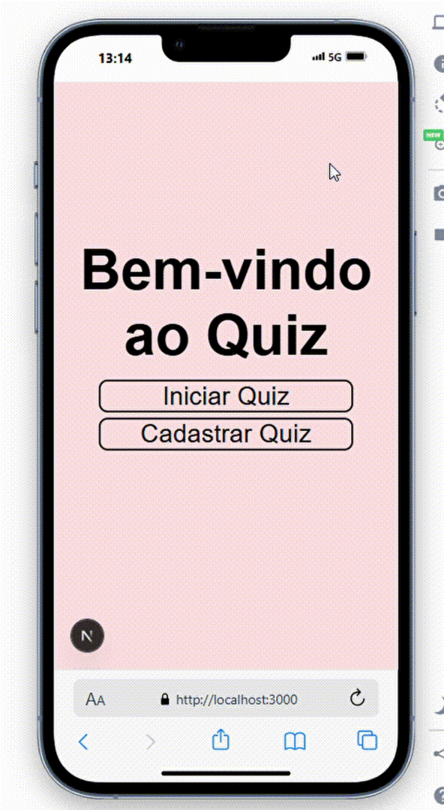
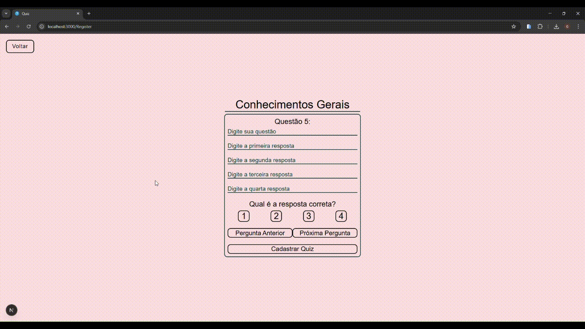

<h1>Quiz</h1>
👨‍💻 Aplicação web full-stack onde os usuários podem cadastrar e jogar quizzes de outros jogadores. 
❓ Cadastro mínimo de 5 questões por quiz. 
💻 Front-end e back-end construidos em Typescript. 
🧪 Testes automatizados feitos em Jest e Cypress. 
🤏🏽 Aplicação totalmente responsiva. 
🚪 Acesse aqui: https://quiz-frontend-three-rose.vercel.app/

<h2>Tecnologias Utilizadas</h2>
    <h3>Front-end</h3>
    - Next JS  
    - Styled Components  
    <h3>Back-end</h3>
    - Node JS com Express como framework 
    - Postgres como banco de dados e Prisma como ORM  
    - Docker 

    
<h2>Jogando um Quiz</h2>  

<h2>Criando um Quiz</h2>  
